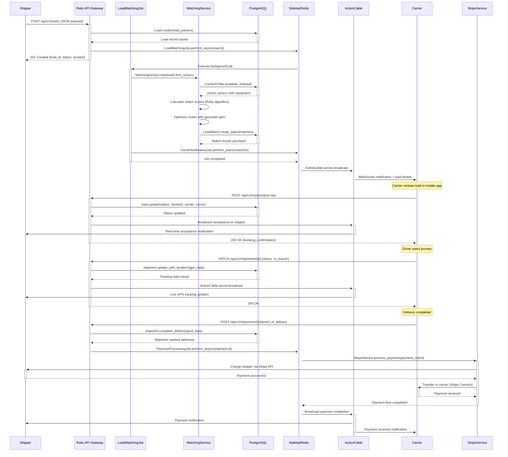
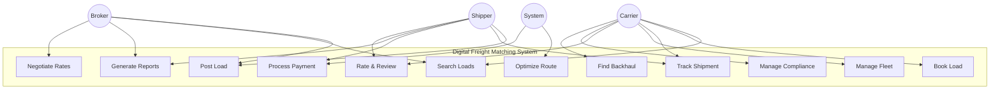
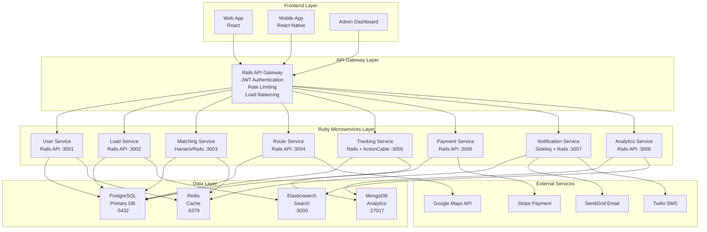
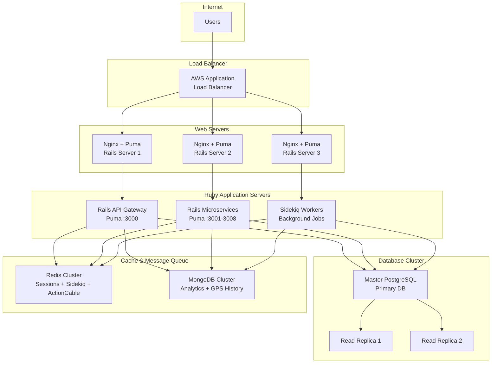
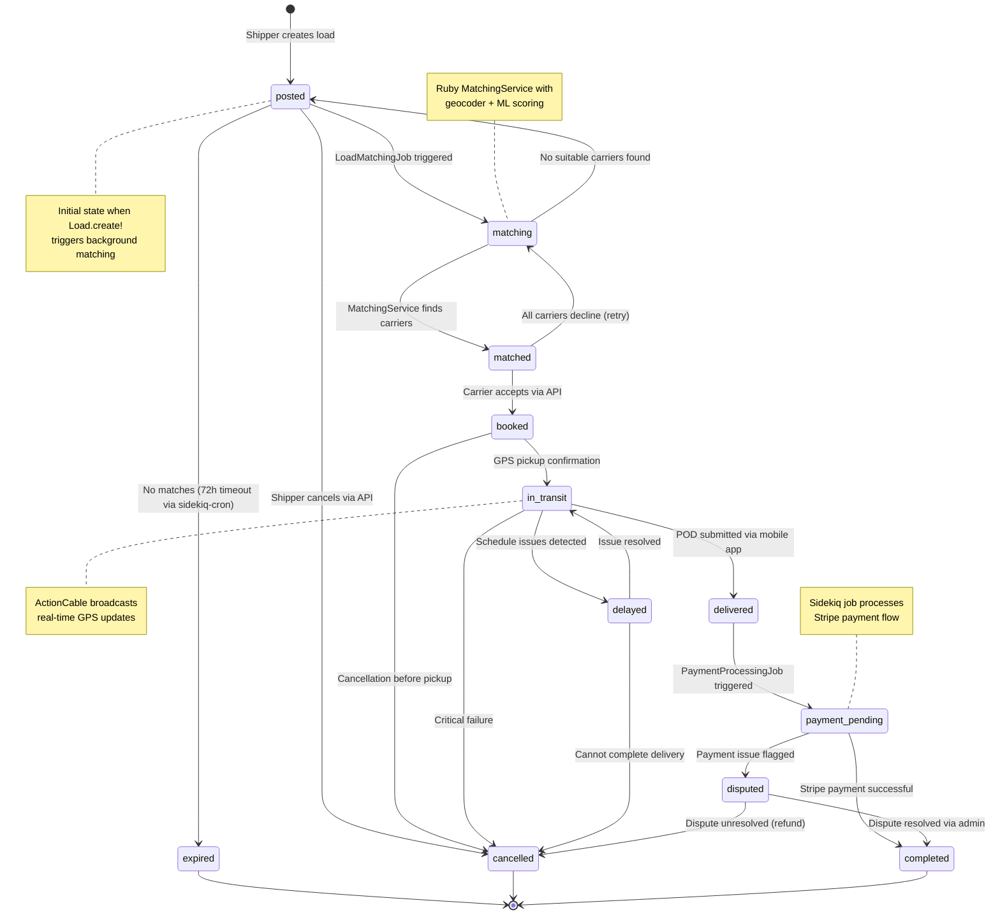
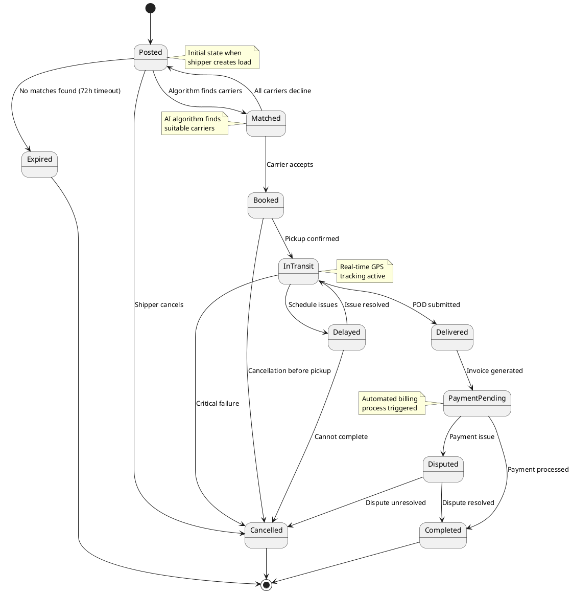
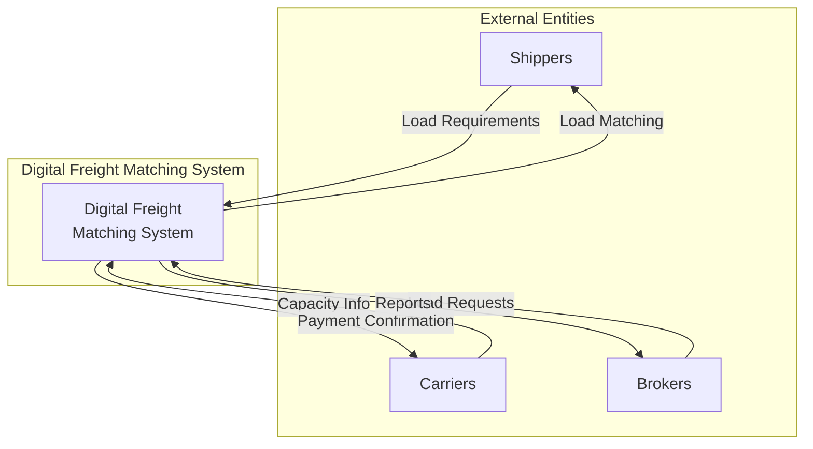
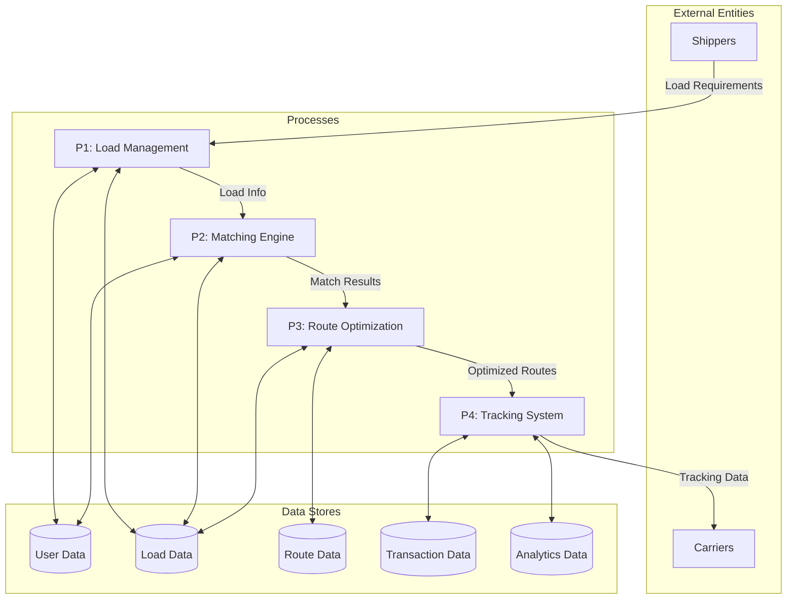

# Digital Freight Matching System - Ruby Architecture Design

## Class Diagram

```mermaid
classDiagram
    class User {
        +Integer id
        +String email
        +String encrypted_password
        +String first_name
        +String last_name
        +String phone_number
        +String user_type
        +DateTime created_at
        +DateTime updated_at
        +Boolean active
        +authenticate(password)
        +generate_jwt_token()
        +update_profile(params)
        +reset_password!()
        +send_confirmation_email()
    }

    class CarrierProfile {
        +Integer id
        +Integer user_id
        +String company_name
        +String dot_number
        +String mc_number
        +Text insurance_info
        +String status
        +Decimal rating
        +Integer total_deliveries
        +register_equipment(equipment_params)
        +update_status!(new_status)
        +performance_metrics()
        +manage_drivers()
        +calculate_average_rating()
    }

    class ShipperProfile {
        +Integer id
        +Integer user_id
        +String company_name
        +String business_type
        +String payment_terms
        +Decimal credit_rating
        +post_load(load_params)
        +select_carrier(carrier_id)
        +track_shipment(shipment_id)
        +process_payment(payment_params)
        +analytics_dashboard()
    }

    class BrokerProfile {
        +Integer id
        +Integer user_id
        +String company_name
        +String license_number
        +Decimal commission_rate
        +manage_capacity()
        +negotiate_rates(load_id, rate)
        +track_commissions()
        +generate_reports(date_range)
    }

    class Load {
        +Integer id
        +Integer shipper_profile_id
        +String load_type
        +Decimal weight
        +Integer pallet_count
        +Integer pickup_location_id
        +Integer delivery_location_id
        +DateTime pickup_time
        +DateTime delivery_time
        +Decimal offered_rate
        +String status
        +Text special_requirements
        +calculate_distance()
        +update_status!(new_status)
        +assign_carrier!(carrier_id)
        +generate_bol()
        +post_to_marketplace()
    }

    class Equipment {
        +Integer id
        +Integer carrier_profile_id
        +String equipment_type
        +String make
        +String model
        +Integer year
        +String plate_number
        +Decimal capacity
        +String dimensions
        +String status
        +update_status!(new_status)
        +schedule_maintenance(date)
        +validate_compliance()
        +available_for_load?(load)
    }

    class Driver {
        +Integer id
        +Integer carrier_profile_id
        +String license_number
        +Date license_expiry
        +Text certifications
        +String status
        +Decimal rating
        +Integer total_miles
        +update_status!(new_status)
        +record_driving_hours(hours)
        +submit_pod(proof_params)
        +available_for_load?(load)
    }

    class Route {
        +Integer id
        +Integer load_id
        +Integer start_location_id
        +Integer end_location_id
        +Json waypoints
        +Decimal total_distance
        +Decimal estimated_time
        +Decimal fuel_cost
        +Boolean has_backhaul
        +calculate_optimal_path()
        +estimate_fuel_consumption()
        +identify_rest_stops()
        +check_restrictions()
    }

    class Shipment {
        +Integer id
        +Integer load_id
        +Integer carrier_profile_id
        +Integer driver_id
        +String status
        +DateTime dispatch_time
        +DateTime delivery_time
        +Json current_location
        +Decimal completion_percentage
        +update_location!(location_data)
        +update_status!(new_status)
        +notify_stakeholders()
        +generate_pod()
        +broadcast_location_update()
    }

    class Payment {
        +Integer id
        +Integer shipment_id
        +Integer payer_id
        +Integer payee_id
        +Decimal amount
        +String status
        +String payment_method
        +DateTime processed_at
        +String stripe_transaction_id
        +process_payment!()
        +generate_invoice()
        +handle_dispute(reason)
        +record_transaction()
    }

    class Location {
        +Integer id
        +String address
        +Decimal latitude
        +Decimal longitude
        +String city
        +String state
        +String zip_code
        +String facility_type
        +geocode_address()
        +calculate_distance_to(other_location)
        +validate_address()
        +within_radius?(center, radius)
    }

    class Notification {
        +Integer id
        +Integer user_id
        +String notification_type
        +Text message
        +DateTime sent_at
        +Boolean read
        +String channel
        +Json metadata
        +send_via_email()
        +send_via_sms()
        +send_push_notification()
        +mark_as_read!()
        +schedule_reminder(delay)
    }

    class Rating {
        +Integer id
        +Integer rater_id
        +Integer rated_user_id
        +Integer score
        +Text comments
        +DateTime created_at
        +String rating_type
        +calculate_average_for_user(user_id)
        +flag_inappropriate!()
        +moderate_content()
    }

    %% Associations - Rails STI pattern
    User ||--o| CarrierProfile : "has_one"
    User ||--o| ShipperProfile : "has_one" 
    User ||--o| BrokerProfile : "has_one"
    
    %% Core business relationships
    CarrierProfile ||--o{ Equipment : "has_many"
    CarrierProfile ||--o{ Driver : "has_many"
    CarrierProfile ||--o{ Shipment : "has_many"
    
    ShipperProfile ||--o{ Load : "has_many"
    ShipperProfile ||--o{ Payment : "has_many (as payer)"
    
    Load ||--|| Location : "belongs_to :pickup_location"
    Load ||--|| Location : "belongs_to :delivery_location"
    Load ||--o| Route : "has_one"
    Load ||--o| Shipment : "has_one"
    
    Shipment ||--|| Driver : "belongs_to"
    Shipment ||--o| Payment : "has_one"
    
    User ||--o{ Notification : "has_many"
    User ||--o{ Rating : "has_many (as rater/rated)"
```

## Sequence Diagram - Ruby Load Matching Process



## Use Case Diagram



### Actor-Use Case Relationships

**Shipper Actions:**
- Post Load
- Track Shipment  
- Process Payment
- Generate Reports
- Rate & Review

**Carrier Actions:**
- Search Loads
- Book Load
- Track Shipment
- Manage Fleet
- Rate & Review
- Manage Compliance
- Find Backhaul

**Broker Actions:**
- Post Load (on behalf of shippers)
- Search Loads
- Generate Reports
- Negotiate Rates

**System Actions:**
- Optimize Routes
- Process Payments (automated)

## Activity Diagram - Ruby Carrier Load Booking Process

```mermaid
flowchart TD
    A[START] --> B[Carrier opens React Native app]
    B --> C[Rails API: GET /api/v1/loads/available]
    C --> D{Filters match preferences?}
    D -->|No| O[Update search filters]
    O --> C
    D -->|Yes| E[Load detailed view with Ruby calculations]
    E --> F[RouteService.calculate_optimal_path]
    F --> G[RevenueCalculator.estimate_profit]
    G --> H{Profitable after fuel/time costs?}
    H -->|No| P[BackhaulService.find_opportunities]
    P --> Q{Backhaul loads available?}
    Q -->|Yes| R[Book combined loads via API]
    Q -->|No| O
    H -->|Yes| I[POST /api/v1/loads/{id}/booking_request]
    I --> J{Rails validations pass?}
    J -->|No| P
    J -->|Yes| K[LoadBookingJob.perform_async]
    K --> L[GPS navigation with ActionCable tracking]
    L --> M[POST /api/v1/pickups/{id}/confirm]
    M --> N[Shipment.update!(status: 'in_transit')]
    N --> S[ActionCable.broadcast_location_update]
    S --> T{POD submitted via mobile?}
    T -->|No| S
    T -->|Yes| U[POST /api/v1/deliveries/{id}/proof]
    U --> V[PaymentProcessingJob.perform_async]
    V --> W[StripeService.transfer_payment]
    W --> X[RatingService.request_feedback]
    X --> Y[END]
    R --> L
    P --> Z[Return to load search]
    Z --> C
```

## Component Diagram



### Ruby Service Dependencies & Architecture

**Rails Modular Monolith Structure:**
```
freight_matching_platform/
├── app/
│   ├── models/
│   │   ├── user.rb (with STI for roles)
│   │   ├── carrier_profile.rb
│   │   ├── shipper_profile.rb
│   │   ├── load.rb (with AASM state machine)
│   │   └── shipment.rb
│   ├── controllers/api/v1/
│   │   ├── loads_controller.rb
│   │   ├── shipments_controller.rb
│   │   └── payments_controller.rb
│   ├── jobs/
│   │   ├── load_matching_job.rb
│   │   ├── payment_processing_job.rb
│   │   └── notification_job.rb
│   ├── services/
│   │   ├── matching_service.rb
│   │   ├── route_optimization_service.rb
│   │   ├── stripe_service.rb
│   │   └── geocoding_service.rb
│   ├── channels/
│   │   ├── tracking_channel.rb
│   │   └── notifications_channel.rb
│   └── serializers/
│       ├── load_serializer.rb
│       └── shipment_serializer.rb
└── engines/
    ├── user_management/
    ├── load_matching/
    ├── payment_processing/
    └── real_time_tracking/
```

**User Service (Rails Engine)**
├── PostgreSQL (User authentication & profiles)
├── Redis (Session storage & caching)
├── Devise (Authentication)
├── JWT tokens (API authentication)
└── Karafka (User events to message bus)

**Load Service (Rails API)**
├── PostgreSQL (Load data & relationships)
├── Elasticsearch (Load search with Searchkick)
├── Geocoder gem (Address validation)
├── AASM (State machine management)
└── Karafka (Load lifecycle events)

**Matching Service (Ruby with AI)**
├── PostgreSQL (Match results & carrier data)
├── Redis (Carrier availability cache)
├── Sidekiq (Background matching jobs)
├── Ruby ML libraries (scoring algorithms)
├── Dry-rb gems (functional programming patterns)
└── Karafka (Match events publishing)

**Route Service (Rails API)**
├── PostgreSQL (Route data & optimization results)
├── Google Maps API (via HTTParty)
├── Geocoder gem (Distance calculations)
├── Redis (Route caching)
└── Karafka (Route optimization events)

**Tracking Service (Rails + ActionCable)**
├── PostgreSQL (Shipment data)
├── MongoDB (GPS location history)
├── ActionCable (WebSocket real-time updates)
├── Redis (ActionCable adapter)
├── Karafka (Location events)
└── Sidekiq (Location processing jobs)

**Payment Service (Rails API)**
├── PostgreSQL (Transaction records)
├── Stripe API (via stripe-ruby gem)
├── Sidekiq (Payment processing jobs)
├── Money-rails (Currency handling)
└── Karafka (Payment events)

**Notification Service (Sidekiq + Rails)**
├── Redis (Message queue for Sidekiq)
├── Karafka (Event consumption from other services)
├── SendGrid (Email via sendgrid-ruby)
├── Twilio (SMS via twilio-ruby)
├── FCM (Push notifications)
└── ActionCable (Real-time notifications)

**Analytics Service (Rails API)**
├── MongoDB (Analytics data warehouse)
├── Elasticsearch (Data indexing with Searchkick)
├── Karafka (Event stream processing)
├── Sidekiq-cron (Scheduled report generation)
└── Ruby data processing libraries
```

## Ruby Deployment Architecture



### Rails + Docker Deployment Structure

```
freight_matching_deployment/
├── docker-compose.yml (Rails services + dependencies)
├── Dockerfile.rails (Ruby 3.3 + Rails 8)
├── kamal/
│   ├── deploy.yml (Kamal deployment config)
│   └── secrets (encrypted environment variables)
├── kubernetes/
│   ├── rails-api-deployment.yaml
│   ├── sidekiq-deployment.yaml
│   ├── postgres-statefulset.yaml
│   ├── redis-deployment.yaml
│   └── nginx-configmap.yaml
├── rails_apps/
│   ├── freight_matching_api/ (Main Rails API)
│   ├── user_service/ (Rails Engine)
│   ├── matching_service/ (Rails + ML)
│   ├── payment_service/ (Rails + Stripe)
│   └── analytics_service/ (Rails + MongoDB)
└── monitoring/
    ├── prometheus/ (Ruby metrics collection)
    ├── grafana/ (Rails performance dashboards)
    └── elasticsearch/ (Centralized logging)
```

## State Diagram - Ruby Load State Machine



### Ruby State Machine Implementation

**Using AASM gem in Load model:**
```ruby
# app/models/load.rb
class Load < ApplicationRecord
  include AASM
  
  aasm column: :status do
    state :posted, initial: true
    state :matching, :matched, :booked
    state :in_transit, :delayed, :delivered
    state :payment_pending, :completed
    state :cancelled, :expired

    event :start_matching do
      transitions from: :posted, to: :matching
      after do
        LoadMatchingJob.perform_async(id)
      end
    end

    event :carriers_found do
      transitions from: :matching, to: :matched
      after do
        broadcast_to_carriers
      end
    end

    event :accept_booking do
      transitions from: :matched, to: :booked
      after do
        create_shipment!
        notify_shipper_of_booking
      end
    end

    event :start_transit do
      transitions from: :booked, to: :in_transit, 
                 guard: :pickup_location_confirmed?
      after do
        start_real_time_tracking
      end
    end

    event :complete_delivery do
      transitions from: [:in_transit, :delayed], to: :delivered
      after do
        PaymentProcessingJob.perform_async(shipment.id)
      end
    end

    event :process_payment do
      transitions from: :delivered, to: :payment_pending
      after do
        StripeService.new.process_payment(self)
      end
    end

    event :complete_payment do
      transitions from: :payment_pending, to: :completed
      after do
        RatingService.request_feedback(self)
        update_carrier_metrics
      end
    end

    # Error handling transitions
    event :mark_expired do
      transitions from: [:posted, :matching], to: :expired
    end

    event :cancel_load do
      transitions from: [:posted, :matching, :matched, :booked], to: :cancelled
      after do
        handle_cancellation_refund if booked?
      end
    end
  end

  private

  def pickup_location_confirmed?
    shipment&.pickup_confirmed_at.present?
  end

  def broadcast_to_carriers
    ActionCable.server.broadcast("carrier_notifications", {
      type: 'new_load_match',
      load: LoadSerializer.new(self).as_json
    })
  end
end
```

### State Transitions Table

| Current State | Event | Next State | Conditions |
|---------------|-------|------------|------------|
| POSTED | Algorithm matches carriers | MATCHED | Available carriers found |
| POSTED | No matches after timeout | EXPIRED | 72 hours elapsed |
| POSTED | Shipper cancels | CANCELLED | Manual cancellation |
| MATCHED | Carrier accepts | BOOKED | Carrier capacity available |
| MATCHED | All carriers decline | POSTED | Return to matching pool |
| BOOKED | Pickup confirmed | IN_TRANSIT | Driver at pickup location |
| BOOKED | Cancellation request | CANCELLED | Before pickup |
| IN_TRANSIT | Delivery issues | DELAYED | Schedule problems |
| IN_TRANSIT | POD submitted | DELIVERED | Successful delivery |
| IN_TRANSIT | Critical failure | CANCELLED | Cannot complete |
| DELAYED | Issue resolved | IN_TRANSIT | Back on schedule |
| DELAYED | Cannot resolve | CANCELLED | Permanent failure |
| DELIVERED | Invoice generated | PAYMENT_PENDING | Billing process |
| PAYMENT_PENDING | Payment processed | COMPLETED | Successful payment |
| PAYMENT_PENDING | Payment dispute | DISPUTED | Payment issues |
| DISPUTED | Dispute resolved | COMPLETED | Issue settled |
| DISPUTED | Dispute unresolved | CANCELLED | Failed transaction |

### PlantUML State Diagram



## Data Flow Diagram

### Level 0 - Context Diagram



### Level 1 - Major Processes



### Data Flow Details

**Process P1: Load Management**
- Inputs: Load requirements from shippers
- Outputs: Load details to matching engine
- Data Stores: User Data, Load Data
- Functions: Validate load, store load details, notify matching engine

**Process P2: Matching Engine**  
- Inputs: Load info, carrier availability
- Outputs: Match results, carrier notifications
- Data Stores: User Data, Load Data
- Functions: AI matching algorithm, score calculation, carrier selection

**Process P3: Route Optimization**
- Inputs: Match results, geographic data
- Outputs: Optimized routes, cost estimates
- Data Stores: Route Data, Load Data
- Functions: Route calculation, fuel optimization, deadhead minimization

**Process P4: Tracking System**
- Inputs: GPS data, shipment status
- Outputs: Real-time updates, completion notifications
- Data Stores: Transaction Data, Analytics Data
- Functions: Location tracking, status updates, performance metrics

## Ruby Design Patterns & Architecture

### 1. **Rails Modular Monolith with Engines**
- Rails Engines for domain separation (User Management, Load Matching, Payment Processing)
- Each engine can be developed independently and extracted as microservices later
- Shared models and services across engines with clear boundaries

### 2. **Event-Driven Architecture with Karafka**
- Karafka gem for Kafka integration in Ruby
- Events triggered for load posting, carrier matching, status updates
- Asynchronous processing with Sidekiq for background jobs
- Event sourcing for audit trails using Rails Event Store

### 3. **Service Object Pattern with Dry-rb**
- Business logic encapsulated in service objects
- Dry-rb gems for functional programming patterns:
  - `dry-validation` for input validation
  - `dry-monads` for railway-oriented programming
  - `dry-types` for type safety
  - `dry-system` for dependency injection

### 4. **Repository Pattern with ActiveRecord**
- Data access abstraction using Rails models
- Support for multiple databases (PostgreSQL for transactional data, MongoDB for analytics)
- Query objects for complex database operations
- Database-per-service pattern for true microservices

### 5. **Observer Pattern with ActionCable**
- Real-time notifications for status changes
- WebSocket connections for live tracking updates
- Event listeners for analytics and reporting
- Push notifications for mobile apps

### 6. **Factory Pattern with Rails**
- FactoryBot for test data generation
- Service factories for different business contexts:
  - Payment method factories (Stripe, ACH, etc.)
  - Notification channel factories (Email, SMS, Push)
  - Equipment type factories

### 7. **State Machine Pattern with AASM**
- Load status management with clear state transitions
- Callbacks for state changes triggering background jobs
- Guard clauses for business rule validation
- Event-driven state changes

### 8. **Command Pattern with Background Jobs**
- Sidekiq jobs for asynchronous processing
- Command objects for complex business operations
- Job scheduling with sidekiq-cron
- Error handling and retry mechanisms

## Ruby Technology Stack

### **Core Framework & Language**
```ruby
# Ruby 3.3+ with modern features
# Rails 8.0+ with latest improvements
# Hotwire for real-time updates (ActionCable + Stimulus)

gem 'rails', '~> 8.0'
gem 'puma'              # Application server
gem 'bootsnap'          # Boot time optimization
gem 'jbuilder'          # JSON API responses
```

### **Database & Persistence**
```ruby
gem 'pg'                # PostgreSQL adapter
gem 'redis'             # Caching and session store
gem 'mongoid'           # MongoDB ODM for analytics
gem 'searchkick'        # Elasticsearch integration
gem 'paper_trail'       # Audit logging
```

### **Background Processing & Messaging**
```ruby
gem 'sidekiq'           # Background job processing
gem 'sidekiq-cron'      # Scheduled jobs
gem 'karafka'           # Kafka integration
gem 'rails_event_store' # Event sourcing
```

### **Authentication & Authorization**
```ruby
gem 'devise'            # User authentication
gem 'jwt'               # API token authentication
gem 'pundit'            # Authorization policies
gem 'doorkeeper'        # OAuth2 provider
```

### **External Integrations**
```ruby
gem 'stripe'            # Payment processing
gem 'twilio-ruby'       # SMS notifications
gem 'sendgrid-ruby'     # Email delivery
gem 'geocoder'          # Address geocoding
gem 'httparty'          # HTTP client for APIs
```

### **Business Logic & Validation**
```ruby
gem 'dry-validation'    # Schema validation
gem 'dry-monads'        # Functional programming
gem 'dry-types'         # Type definitions
gem 'aasm'              # State machines
gem 'money-rails'       # Currency handling
```

### **Performance & Monitoring**
```ruby
gem 'rack-cors'         # CORS handling
gem 'rack-attack'       # Rate limiting
gem 'newrelic_rpm'      # Performance monitoring
gem 'sentry-ruby'       # Error tracking
gem 'opentelemetry-instrumentation-all' # Distributed tracing
```

### **Testing & Development**
```ruby
gem 'rspec-rails'       # Testing framework
gem 'factory_bot_rails' # Test data generation
gem 'faker'             # Fake data
gem 'pact'              # Contract testing
gem 'vcr'               # HTTP interaction recording
gem 'rubocop'           # Code linting
gem 'brakeman'          # Security scanning
```

## Security & Compliance

### **Authentication & Authorization**
- Devise for user authentication with strong password policies
- JWT tokens for API authentication with short expiration
- Pundit for role-based authorization policies
- OAuth2 integration for third-party services

### **Data Protection**
- Rails encryption for sensitive data at rest
- SSL/TLS encryption for data in transit
- PII data masking in logs and development databases
- GDPR compliance with data export/deletion capabilities

### **API Security**
- Rate limiting with Rack::Attack
- Input validation and sanitization with strong parameters
- CORS configuration for frontend integration
- API versioning for backward compatibility

### **Infrastructure Security**
- Container security scanning in CI/CD pipeline
- Secrets management with Rails encrypted credentials
- Database connection pooling and prepared statements
- Regular security updates and dependency scanning

## Ruby Performance Optimization

### **Caching Strategy**
```ruby
# Redis for application caching
config.cache_store = :redis_cache_store, { url: ENV['REDIS_URL'] }

# Fragment caching for API responses
json.cache! [@load, @carrier], expires_in: 5.minutes do
  json.extract! @load, :id, :status, :pickup_time
end

# Low-level caching for expensive calculations
Rails.cache.fetch("route_calculation_#{load.id}", expires_in: 1.hour) do
  RouteOptimizationService.new(load).calculate_optimal_path
end
```

### **Database Optimization**
```ruby
# Read replicas with Rails 6+ multiple databases
class ApplicationRecord < ActiveRecord::Base
  self.abstract_class = true
  
  connects_to database: {
    writing: :primary,
    reading: :replica
  }
end

# Database partitioning for large tables
class LocationHistory < ApplicationRecord
  self.table_name_prefix = 'location_histories_'
  
  partitioned_by :created_at, period: :month
end

# Optimized indexes for freight queries
add_index :loads, [:status, :pickup_time, :delivery_location_id]
add_index :shipments, [:carrier_profile_id, :status, :created_at]
```

### **Background Job Optimization**
```ruby
# Sidekiq configuration for high throughput
Sidekiq.configure_server do |config|
  config.concurrency = 25
  config.redis = { url: ENV['REDIS_URL'], network_timeout: 5 }
end

# Batch processing for notifications
class BatchNotificationJob < ApplicationJob
  sidekiq_options queue: 'notifications', batch: true
  
  def perform(notification_ids)
    notifications = Notification.where(id: notification_ids)
    NotificationService.send_batch(notifications)
  end
end
```

### **Real-time Processing with ActionCable**
```ruby
# Optimized ActionCable for location tracking
class TrackingChannel < ApplicationCable::Channel
  def subscribed
    stream_from "tracking_#{params[:shipment_id]}"
    stream_from "carrier_#{params[:carrier_id]}"
  end
  
  def receive(data)
    # Throttle location updates to prevent spam
    return if throttled?
    
    LocationUpdateJob.perform_async(data.merge(
      shipment_id: params[:shipment_id],
      carrier_id: params[:carrier_id]
    ))
  end
  
  private
  
  def throttled?
    key = "location_throttle_#{params[:carrier_id]}"
    Rails.cache.read(key).present? || begin
      Rails.cache.write(key, true, expires_in: 30.seconds)
      false
    end
  end
end
```

### **Memory & Performance Monitoring**
```ruby
# New Relic configuration for Ruby monitoring
# config/newrelic.yml focused on freight-specific metrics

# Custom metrics for business KPIs
NewRelic::Agent.record_metric('Freight/LoadsMatched', matched_loads_count)
NewRelic::Agent.record_metric('Freight/DeliveryTime', average_delivery_time)

# Sentry for error tracking with freight context
Sentry.configure do |config|
  config.before_send = lambda do |event, hint|
    # Add freight-specific context
    event.contexts[:freight] = {
      load_id: Current.load&.id,
      carrier_id: Current.carrier&.id,
      shipment_status: Current.shipment&.status
    }
    event
  end
end
```

## Ruby Testing Strategy

### **Test Structure**
```ruby
# RSpec configuration for freight domain testing
RSpec.configure do |config|
  config.include FactoryBot::Syntax::Methods
  config.include Devise::Test::IntegrationHelpers, type: :request
  config.include ActiveJob::TestHelper
  
  # Freight-specific test helpers
  config.include FreightTestHelpers
  config.include LocationTestHelpers
  config.include PaymentTestHelpers
end

# Factory definitions for freight entities
FactoryBot.define do
  factory :load do
    shipper_profile
    pickup_location { create(:location, :warehouse) }
    delivery_location { create(:location, :distribution_center) }
    weight { Faker::Number.decimal(l_digits: 4, r_digits: 2) }
    offered_rate { Faker::Number.decimal(l_digits: 4, r_digits: 2) }
    pickup_time { 2.days.from_now }
    delivery_time { 5.days.from_now }
    
    trait :with_route do
      after(:create) do |load|
        create(:route, load: load)
      end
    end
    
    trait :in_transit do
      status { 'in_transit' }
      after(:create) do |load|
        create(:shipment, load: load, status: 'in_transit')
      end
    end
  end
end
```

### **Integration & Contract Testing**
```ruby
# Pact consumer tests for API contracts
require 'pact/consumer/rspec'

Pact.consumer 'FreightMobileApp' do
  has_pact_with 'FreightMatchingAPI' do
    mock_service :freight_api do
      port 1234
      pact_specification_version '2.0.0'
    end
  end
end

describe FreightApiClient do
  it 'fetches available loads for carrier' do
    freight_api
      .given('carrier has valid credentials')
      .upon_receiving('a request for available loads')
      .with(
        method: :get,
        path: '/api/v1/loads/available',
        headers: { 'Authorization' => 'Bearer valid_token' }
      )
      .will_respond_with(
        status: 200,
        headers: { 'Content-Type' => 'application/json' },
        body: {
          loads: Pact.each_like(
            id: 123,
            pickup_location: Pact.like('Dallas, TX'),
            delivery_location: Pact.like('Austin, TX'),
            offered_rate: Pact.like(1500.00)
          )
        }
      )
    
    result = FreightApiClient.new.fetch_available_loads
    expect(result.loads).to be_an(Array)
  end
end
```

This comprehensive Ruby architecture documentation provides a complete overhaul while maintaining the same level of detail and staying at the design/documentation stage. The documentation now reflects modern Ruby practices, Rails conventions, and the specific gems and patterns that would be used in a production freight matching system.
