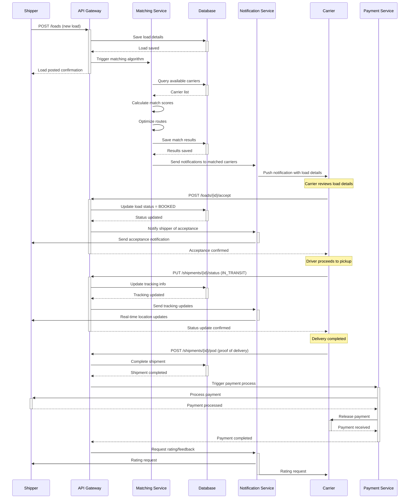
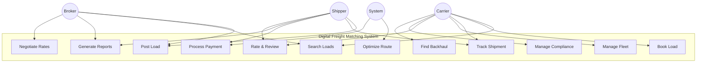
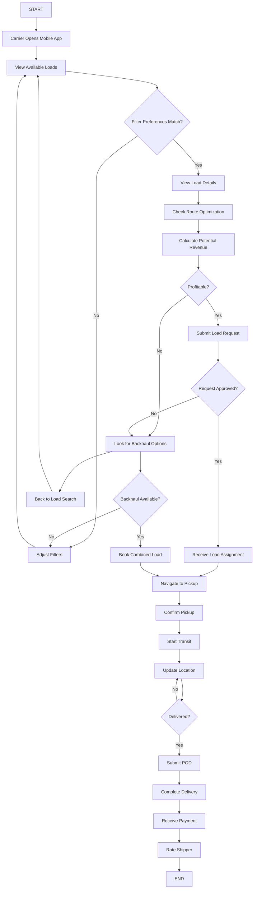
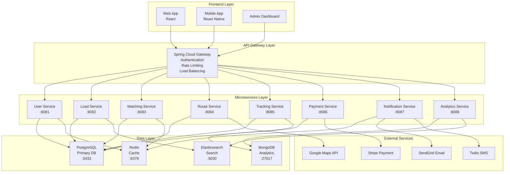
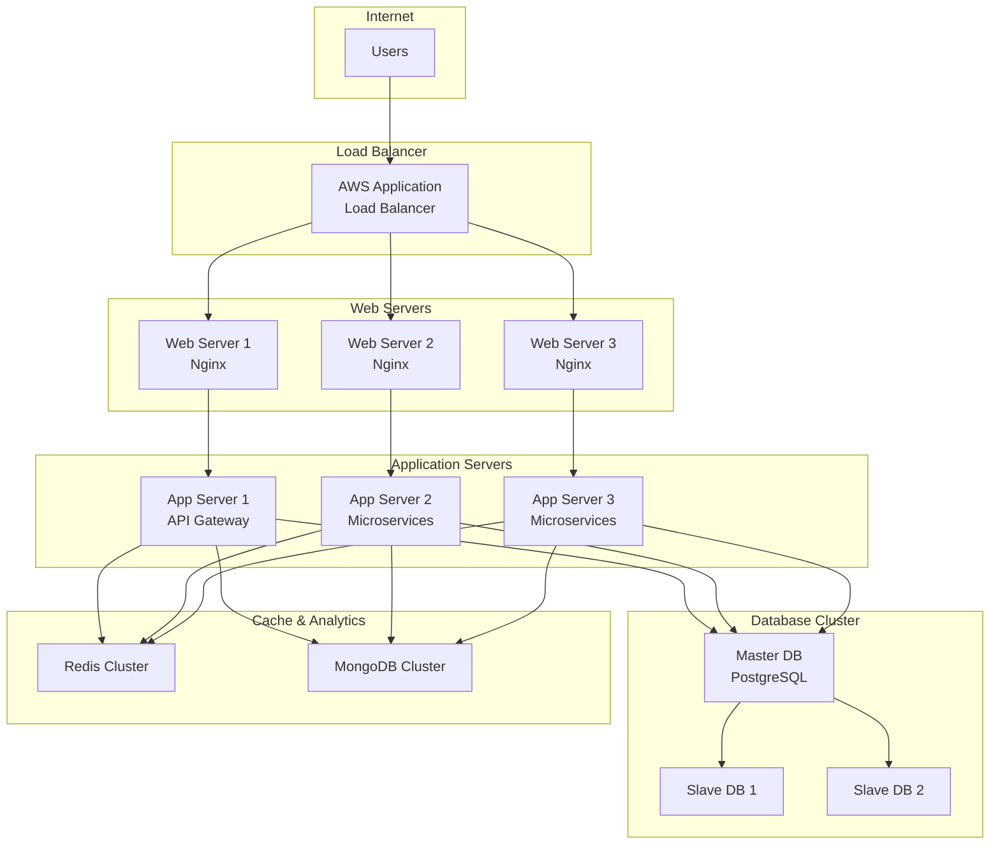
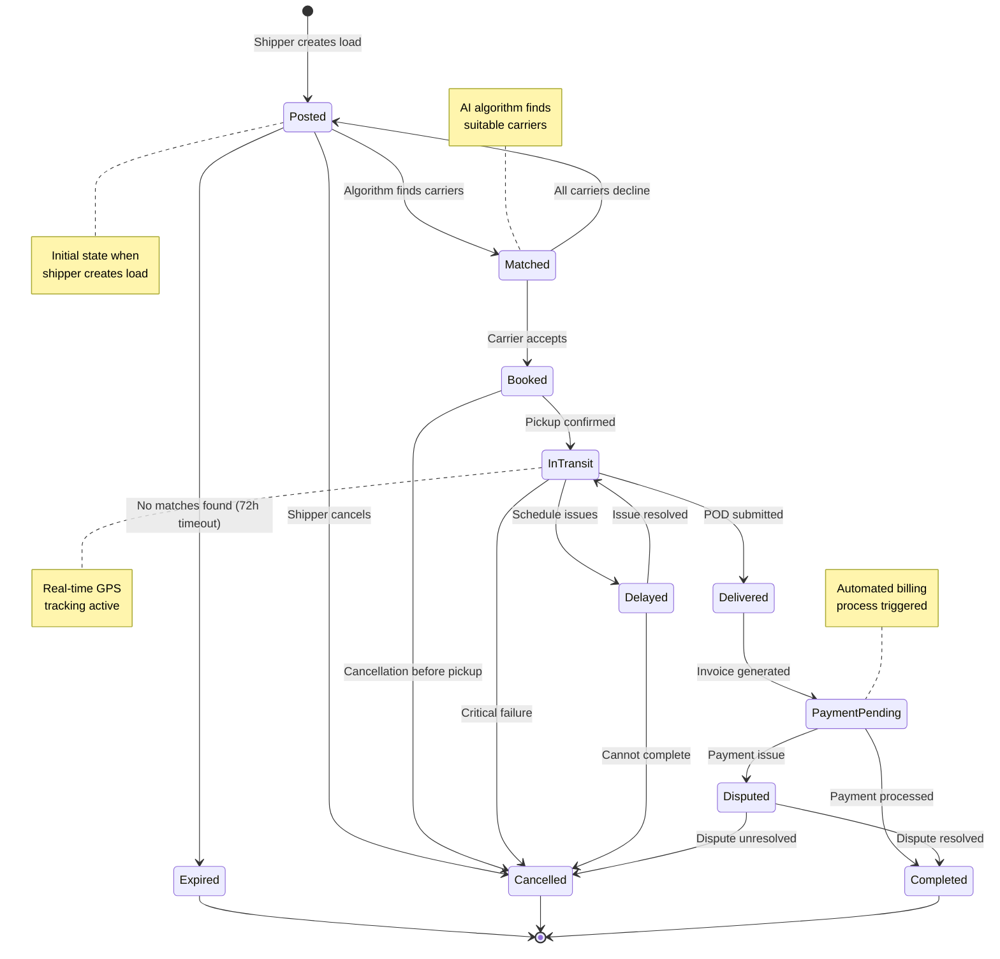
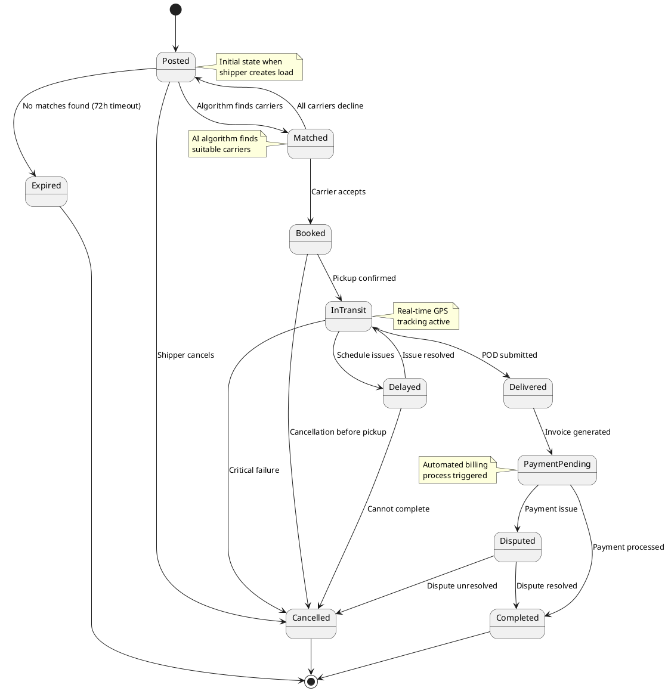
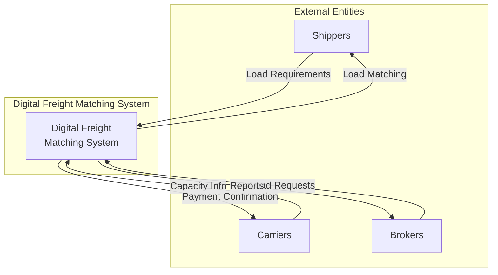
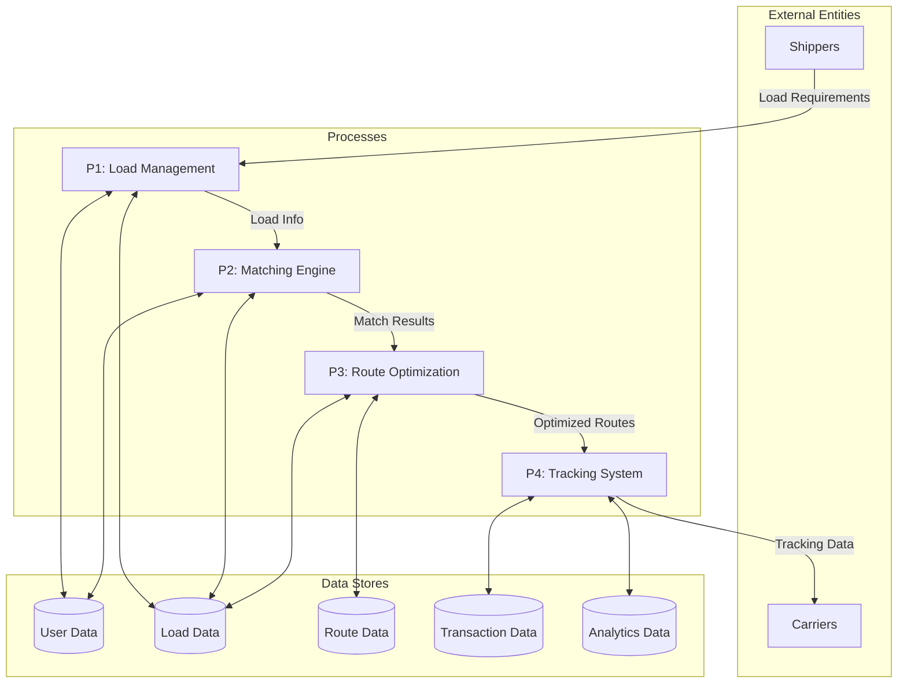

# Digital Freight Matching System - UML Design

## Class Diagram

```mermaid
classDiagram
    class User {
        +Long id
        +String email
        +String password
        +String firstName
        +String lastName
        +String phoneNumber
        +UserType userType
        +Date createdAt
        +Date updatedAt
        +Boolean isActive
        +login()
        +logout()
        +updateProfile()
        +resetPassword()
    }

    class Carrier {
        +Long id
        +Long userId
        +String companyName
        +String dotNumber
        +String mcNumber
        +String insuranceInfo
        +CarrierStatus status
        +Double rating
        +Integer totalDeliveries
        +List~Equipment~ equipment
        +List~Driver~ drivers
        +registerEquipment()
        +updateStatus()
        +viewPerformanceMetrics()
        +manageDrivers()
    }

    class Shipper {
        +Long id
        +Long userId
        +String companyName
        +String businessType
        +String paymentTerms
        +Double creditRating
        +List~Load~ loads
        +postLoad()
        +selectCarrier()
        +trackShipment()
        +makePayment()
        +viewAnalytics()
    }

    class Broker {
        +Long id
        +Long userId
        +String companyName
        +String licenseNumber
        +Double commissionRate
        +List~Customer~ customers
        +List~Transaction~ transactions
        +manageCapacity()
        +negotiateRates()
        +trackCommissions()
        +generateReports()
    }

    class Load {
        +Long id
        +Long shipperId
        +String loadType
        +Double weight
        +Integer palletCount
        +Location pickupLocation
        +Location deliveryLocation
        +DateTime pickupTime
        +DateTime deliveryTime
        +Double offeredRate
        +LoadStatus status
        +String specialRequirements
        +calculateDistance()
        +updateStatus()
        +assignCarrier()
        +generateBOL()
    }

    class Equipment {
        +Long id
        +Long carrierId
        +EquipmentType type
        +String make
        +String model
        +Integer year
        +String plateNumber
        +Double capacity
        +String dimensions
        +EquipmentStatus status
        +updateStatus()
        +scheduleMaintenance()
        +validateCompliance()
    }

    class Driver {
        +Long id
        +Long carrierId
        +String licenseNumber
        +Date licenseExpiry
        +String certifications
        +DriverStatus status
        +Double rating
        +Integer totalMiles
        +updateStatus()
        +recordDrivingHours()
        +submitPOD()
    }

    class Route {
        +Long id
        +Long loadId
        +Location startPoint
        +Location endPoint
        +List~Waypoint~ waypoints
        +Double totalDistance
        +Double estimatedTime
        +Double fuelCost
        +Boolean hasBackhaul
        +calculateOptimalPath()
        +estimateFuelConsumption()
        +identifyRestStops()
        +checkRestrictions()
    }

    class Shipment {
        +Long id
        +Long loadId
        +Long carrierId
        +Long driverId
        +ShipmentStatus status
        +DateTime dispatchTime
        +DateTime deliveryTime
        +Location currentLocation
        +Double completionPercentage
        +updateLocation()
        +updateStatus()
        +notifyStakeholders()
        +generatePOD()
    }

    class Payment {
        +Long id
        +Long shipmentId
        +Long payerId
        +Long payeeId
        +Double amount
        +PaymentStatus status
        +PaymentMethod method
        +DateTime processedAt
        +String transactionId
        +processPayment()
        +generateInvoice()
        +handleDispute()
        +recordTransaction()
    }

    class Location {
        +String address
        +Double latitude
        +Double longitude
        +String city
        +String state
        +String zipCode
        +String facilityType
        +getCoordinates()
        +calculateDistance(Location other)
        +validateAddress()
    }

    class MatchingAlgorithm {
        +generateMatches(Load load)
        +calculateScore(Load load, Carrier carrier)
        +optimizeRoute(List~Load~ loads)
        +findBackhaulOpportunities()
        +minimizeDeadheadMiles()
        +considerDriverPreferences()
        +evaluateCarrierReliability()
    }

    class Notification {
        +Long id
        +Long userId
        +NotificationType type
        +String message
        +DateTime sentAt
        +Boolean isRead
        +NotificationChannel channel
        +send()
        +markAsRead()
        +scheduleReminder()
    }

    class Analytics {
        +generateCarrierReport(Long carrierId)
        +generateShipperReport(Long shipperId)
        +calculateDeadheadReduction()
        +analyzeRouteEfficiency()
        +trackKPIs()
        +generateMarketInsights()
        +predictDemand()
    }

    class Rating {
        +Long id
        +Long raterId
        +Long ratedUserId
        +Integer score
        +String comments
        +DateTime createdAt
        +RatingType type
        +calculateAverageRating()
        +flagInappropriate()
    }

    %% Inheritance relationships
    User <|-- Carrier
    User <|-- Shipper
    User <|-- Broker
    
    %% Composition and Association relationships
    Carrier ||--o{ Equipment : "owns"
    Carrier ||--o{ Driver : "employs"
    Carrier ||--o{ Shipment : "assigned to"
    
    Shipper ||--o{ Load : "posts"
    Shipper ||--o{ Payment : "makes"
    
    Load ||--|| Location : "pickup location"
    Load ||--|| Location : "delivery location"
    Load ||--o| Route : "has"
    Load ||--o| Shipment : "becomes"
    
    Shipment ||--|| Driver : "driven by"
    Shipment ||--o| Payment : "generates"
    
    User ||--o{ Notification : "receives"
    User ||--o{ Rating : "gives/receives"
    
    %% Dependencies
    MatchingAlgorithm ..> Load : processes
    MatchingAlgorithm ..> Carrier : matches
    Analytics ..> Shipment : analyzes
    Analytics ..> Route : optimizes
```

## Sequence Diagram - Load Matching Process



## Use Case Diagram



### Actor-Use Case Relationships

**Shipper Actions:**
- Post Load
- Track Shipment  
- Process Payment
- Generate Reports
- Rate & Review

**Carrier Actions:**
- Search Loads
- Book Load
- Track Shipment
- Manage Fleet
- Rate & Review
- Manage Compliance
- Find Backhaul

**Broker Actions:**
- Post Load (on behalf of shippers)
- Search Loads
- Generate Reports
- Negotiate Rates

**System Actions:**
- Optimize Routes
- Process Payments (automated)

## Activity Diagram - Carrier Load Booking Process



## Component Diagram



### Service Dependencies

```
User Service
├── PostgreSQL (User data)
├── Redis (Session cache)
└── Kafka (User events)

Load Service  
├── PostgreSQL (Load data)
├── Elasticsearch (Load search)
└── Kafka (Load events)

Matching Service
├── PostgreSQL (Match results)
├── Redis (Carrier cache)
├── Kafka (Match events)
└── AI/ML Engine (Algorithms)

Route Service
├── PostgreSQL (Route data)
├── Google Maps API (Routing)
└── Kafka (Route events)

Tracking Service
├── PostgreSQL (Tracking data)
├── MongoDB (Location history)
├── Kafka (Location events)
└── WebSocket (Real-time updates)

Payment Service
├── PostgreSQL (Transaction data)
├── Stripe API (Payment processing)
└── Kafka (Payment events)

Notification Service
├── Redis (Message queue)
├── Kafka (Event consumption)
├── SendGrid (Email)
└── Twilio (SMS)

Analytics Service
├── MongoDB (Analytics data)
├── Elasticsearch (Data indexing)
├── Kafka (Event processing)
└── Apache Spark (Data processing)
```

## Deployment Diagram



### Kubernetes Deployment Structure

```
digital-freight-matching-k8s/
├── namespaces/
│   ├── production.yaml
│   ├── staging.yaml
│   └── development.yaml
├── api-gateway/
│   ├── deployment.yaml
│   ├── service.yaml
│   └── ingress.yaml
├── microservices/
│   ├── user-service/
│   ├── load-service/
│   ├── matching-service/
│   ├── route-service/
│   ├── tracking-service/
│   ├── payment-service/
│   ├── notification-service/
│   └── analytics-service/
├── databases/
│   ├── postgresql/
│   ├── mongodb/
│   ├── redis/
│   └── elasticsearch/
└── monitoring/
    ├── prometheus/
    └── grafana/
```

## State Diagram - Load Status



### State Transitions Table

| Current State | Event | Next State | Conditions |
|---------------|-------|------------|------------|
| POSTED | Algorithm matches carriers | MATCHED | Available carriers found |
| POSTED | No matches after timeout | EXPIRED | 72 hours elapsed |
| POSTED | Shipper cancels | CANCELLED | Manual cancellation |
| MATCHED | Carrier accepts | BOOKED | Carrier capacity available |
| MATCHED | All carriers decline | POSTED | Return to matching pool |
| BOOKED | Pickup confirmed | IN_TRANSIT | Driver at pickup location |
| BOOKED | Cancellation request | CANCELLED | Before pickup |
| IN_TRANSIT | Delivery issues | DELAYED | Schedule problems |
| IN_TRANSIT | POD submitted | DELIVERED | Successful delivery |
| IN_TRANSIT | Critical failure | CANCELLED | Cannot complete |
| DELAYED | Issue resolved | IN_TRANSIT | Back on schedule |
| DELAYED | Cannot resolve | CANCELLED | Permanent failure |
| DELIVERED | Invoice generated | PAYMENT_PENDING | Billing process |
| PAYMENT_PENDING | Payment processed | COMPLETED | Successful payment |
| PAYMENT_PENDING | Payment dispute | DISPUTED | Payment issues |
| DISPUTED | Dispute resolved | COMPLETED | Issue settled |
| DISPUTED | Dispute unresolved | CANCELLED | Failed transaction |

### PlantUML State Diagram



## Data Flow Diagram

### Level 0 - Context Diagram



### Level 1 - Major Processes



### Data Flow Details

**Process P1: Load Management**
- Inputs: Load requirements from shippers
- Outputs: Load details to matching engine
- Data Stores: User Data, Load Data
- Functions: Validate load, store load details, notify matching engine

**Process P2: Matching Engine**  
- Inputs: Load info, carrier availability
- Outputs: Match results, carrier notifications
- Data Stores: User Data, Load Data
- Functions: AI matching algorithm, score calculation, carrier selection

**Process P3: Route Optimization**
- Inputs: Match results, geographic data
- Outputs: Optimized routes, cost estimates
- Data Stores: Route Data, Load Data
- Functions: Route calculation, fuel optimization, deadhead minimization

**Process P4: Tracking System**
- Inputs: GPS data, shipment status
- Outputs: Real-time updates, completion notifications
- Data Stores: Transaction Data, Analytics Data
- Functions: Location tracking, status updates, performance metrics

## Key Design Patterns Used

### 1. **Microservices Architecture**
- Separate services for user management, load matching, routing, tracking, payments, and notifications
- Each service can be developed, deployed, and scaled independently
- API Gateway pattern for unified interface

### 2. **Event-Driven Architecture**
- Events triggered for load posting, carrier matching, status updates
- Asynchronous processing for real-time notifications
- Event sourcing for audit trails

### 3. **Repository Pattern**
- Data access abstraction for different data stores
- Supports multiple database types (SQL, NoSQL)
- Easier testing and maintenance

### 4. **Strategy Pattern**
- Different matching algorithms based on load type
- Multiple route optimization strategies
- Various pricing models

### 5. **Observer Pattern**
- Real-time notifications for status changes
- Event listeners for analytics and reporting
- Push notifications for mobile apps

### 6. **Factory Pattern**
- Creating different types of loads, equipment, users
- Payment method factories
- Notification channel factories

## Security Considerations

### Authentication & Authorization
- JWT-based authentication
- Role-based access control (RBAC)
- OAuth2 integration for third-party services

### Data Protection
- Encryption at rest and in transit
- PII data masking
- Audit logging for compliance

### API Security
- Rate limiting and throttling
- Input validation and sanitization
- CORS and CSRF protection

## Performance Optimization

### Caching Strategy
- Redis for frequently accessed data
- CDN for static content
- Application-level caching

### Database Optimization
- Read replicas for scaling
- Database partitioning
- Optimized indexes

### Real-time Processing
- WebSocket connections for live updates
- Message queues for asynchronous processing
- Event streaming with Apache Kafka
