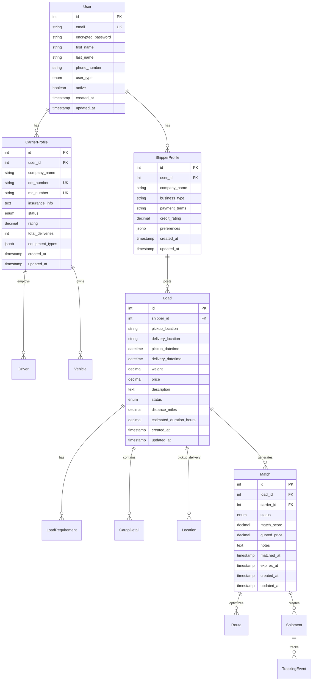

# Database Design

Comprehensive database schema and relationships for the Digital Freight Matching Platform.

## 🗄️ Database Overview

**Database System**: PostgreSQL 16  
**ORM**: ActiveRecord (Rails)  
**Extensions**: PostGIS (for geographic data), JSONB (for flexible data)  
**Security**: Row-Level Security (RLS), encrypted connections  

## 📊 Entity Relationship Diagram



## 🏗️ Core Tables

### Users Table
**Purpose**: Central authentication and user management

```sql
CREATE TABLE users (
    id SERIAL PRIMARY KEY,
    email VARCHAR(255) NOT NULL UNIQUE,
    encrypted_password VARCHAR(255) NOT NULL,
    first_name VARCHAR(100) NOT NULL,
    last_name VARCHAR(100) NOT NULL,
    phone_number VARCHAR(20),
    user_type VARCHAR(20) NOT NULL CHECK (user_type IN ('shipper', 'carrier', 'admin')),
    active BOOLEAN DEFAULT true,
    created_at TIMESTAMP WITH TIME ZONE NOT NULL,
    updated_at TIMESTAMP WITH TIME ZONE NOT NULL
);

-- Indexes
CREATE INDEX idx_users_email ON users(email);
CREATE INDEX idx_users_user_type ON users(user_type);
CREATE INDEX idx_users_active ON users(active);
```

**Row-Level Security**:
```sql
-- Users can only see their own data, admins see all
CREATE POLICY user_access_policy ON users
    FOR ALL TO authenticated_user
    USING (id = current_user_id() OR current_user_role() = 'admin');
```

### Shipper Profiles
**Purpose**: Shipper-specific business information

```sql
CREATE TABLE shipper_profiles (
    id SERIAL PRIMARY KEY,
    user_id INTEGER NOT NULL REFERENCES users(id) ON DELETE CASCADE,
    company_name VARCHAR(255) NOT NULL,
    business_type VARCHAR(100),
    payment_terms VARCHAR(50),
    credit_rating DECIMAL(3,2) CHECK (credit_rating >= 0 AND credit_rating <= 5),
    preferences JSONB DEFAULT '{}',
    created_at TIMESTAMP WITH TIME ZONE NOT NULL,
    updated_at TIMESTAMP WITH TIME ZONE NOT NULL
);

-- Indexes
CREATE UNIQUE INDEX idx_shipper_profiles_user_id ON shipper_profiles(user_id);
CREATE INDEX idx_shipper_profiles_company_name ON shipper_profiles(company_name);
```

### Carrier Profiles
**Purpose**: Carrier company and fleet information

```sql
CREATE TABLE carrier_profiles (
    id SERIAL PRIMARY KEY,
    user_id INTEGER NOT NULL REFERENCES users(id) ON DELETE CASCADE,
    company_name VARCHAR(255) NOT NULL,
    dot_number VARCHAR(20) UNIQUE,
    mc_number VARCHAR(20) UNIQUE,
    insurance_info TEXT,
    status VARCHAR(20) DEFAULT 'active' CHECK (status IN ('active', 'inactive', 'suspended')),
    rating DECIMAL(3,2) DEFAULT 0 CHECK (rating >= 0 AND rating <= 5),
    total_deliveries INTEGER DEFAULT 0,
    equipment_types JSONB DEFAULT '[]',
    created_at TIMESTAMP WITH TIME ZONE NOT NULL,
    updated_at TIMESTAMP WITH TIME ZONE NOT NULL
);

-- Indexes
CREATE UNIQUE INDEX idx_carrier_profiles_user_id ON carrier_profiles(user_id);
CREATE UNIQUE INDEX idx_carrier_profiles_dot_number ON carrier_profiles(dot_number);
CREATE INDEX idx_carrier_profiles_status ON carrier_profiles(status);
CREATE INDEX idx_carrier_profiles_rating ON carrier_profiles(rating);
```

### Loads Table
**Purpose**: Freight load postings and requirements

```sql
CREATE TABLE loads (
    id SERIAL PRIMARY KEY,
    shipper_id INTEGER NOT NULL REFERENCES shipper_profiles(id),
    pickup_location VARCHAR(500) NOT NULL,
    delivery_location VARCHAR(500) NOT NULL,
    pickup_datetime TIMESTAMP WITH TIME ZONE NOT NULL,
    delivery_datetime TIMESTAMP WITH TIME ZONE NOT NULL,
    weight DECIMAL(10,2),
    price DECIMAL(10,2) NOT NULL,
    description TEXT,
    status VARCHAR(20) DEFAULT 'posted' CHECK (status IN ('posted', 'matched', 'in_transit', 'delivered', 'cancelled')),
    distance_miles DECIMAL(8,2),
    estimated_duration_hours DECIMAL(6,2),
    created_at TIMESTAMP WITH TIME ZONE NOT NULL,
    updated_at TIMESTAMP WITH TIME ZONE NOT NULL
);

-- Indexes for search optimization
CREATE INDEX idx_loads_status ON loads(status);
CREATE INDEX idx_loads_pickup_datetime ON loads(pickup_datetime);
CREATE INDEX idx_loads_delivery_datetime ON loads(delivery_datetime);
CREATE INDEX idx_loads_price ON loads(price);
CREATE INDEX idx_loads_weight ON loads(weight);
CREATE INDEX idx_loads_distance_miles ON loads(distance_miles);

-- Composite indexes for common queries
CREATE INDEX idx_loads_status_pickup_date ON loads(status, pickup_datetime);
CREATE INDEX idx_loads_shipper_status ON loads(shipper_id, status);
```

## 🔗 Relationship Tables

### Load Requirements
**Purpose**: Special requirements for freight loads

```sql
CREATE TABLE load_requirements (
    id SERIAL PRIMARY KEY,
    load_id INTEGER NOT NULL REFERENCES loads(id) ON DELETE CASCADE,
    equipment_type VARCHAR(50) NOT NULL,
    hazmat BOOLEAN DEFAULT false,
    temperature_controlled BOOLEAN DEFAULT false,
    special_handling TEXT,
    certification_required VARCHAR(100),
    created_at TIMESTAMP WITH TIME ZONE NOT NULL,
    updated_at TIMESTAMP WITH TIME ZONE NOT NULL
);

-- Indexes
CREATE INDEX idx_load_requirements_load_id ON load_requirements(load_id);
CREATE INDEX idx_load_requirements_equipment_type ON load_requirements(equipment_type);
CREATE INDEX idx_load_requirements_hazmat ON load_requirements(hazmat);
```

### Cargo Details
**Purpose**: Detailed cargo specifications

```sql
CREATE TABLE cargo_details (
    id SERIAL PRIMARY KEY,
    load_id INTEGER NOT NULL REFERENCES loads(id) ON DELETE CASCADE,
    freight_class VARCHAR(10),
    nmfc_code VARCHAR(20),
    pieces INTEGER,
    packaging VARCHAR(50),
    dimensions_json JSONB,
    value DECIMAL(12,2),
    created_at TIMESTAMP WITH TIME ZONE NOT NULL,
    updated_at TIMESTAMP WITH TIME ZONE NOT NULL
);

-- JSONB validation for dimensions
ALTER TABLE cargo_details ADD CONSTRAINT valid_dimensions 
CHECK (
    dimensions_json IS NULL OR (
        dimensions_json ? 'length' AND 
        dimensions_json ? 'width' AND 
        dimensions_json ? 'height' AND
        (dimensions_json->>'length')::numeric > 0 AND
        (dimensions_json->>'width')::numeric > 0 AND
        (dimensions_json->>'height')::numeric > 0
    )
);
```

### Locations
**Purpose**: Geographic location management with geocoding

```sql
CREATE TABLE locations (
    id SERIAL PRIMARY KEY,
    address VARCHAR(500) NOT NULL,
    city VARCHAR(100),
    state VARCHAR(50),
    zip_code VARCHAR(20),
    country VARCHAR(50) DEFAULT 'USA',
    latitude DECIMAL(10, 8),
    longitude DECIMAL(11, 8),
    location_type VARCHAR(50),
    created_at TIMESTAMP WITH TIME ZONE NOT NULL,
    updated_at TIMESTAMP WITH TIME ZONE NOT NULL
);

-- Spatial indexes for geographic queries
CREATE INDEX idx_locations_coordinates ON locations(latitude, longitude);
CREATE INDEX idx_locations_city_state ON locations(city, state);
CREATE INDEX idx_locations_zip_code ON locations(zip_code);
```

## 🤝 Matching & Operations

### Matches Table
**Purpose**: Load-to-carrier matching results

```sql
CREATE TABLE matches (
    id SERIAL PRIMARY KEY,
    load_id INTEGER NOT NULL REFERENCES loads(id),
    carrier_id INTEGER NOT NULL REFERENCES carrier_profiles(id),
    status VARCHAR(20) DEFAULT 'pending' CHECK (status IN ('pending', 'accepted', 'rejected', 'expired')),
    match_score DECIMAL(5,2) CHECK (match_score >= 0 AND match_score <= 100),
    quoted_price DECIMAL(10,2),
    notes TEXT,
    matched_at TIMESTAMP WITH TIME ZONE DEFAULT CURRENT_TIMESTAMP,
    expires_at TIMESTAMP WITH TIME ZONE,
    created_at TIMESTAMP WITH TIME ZONE NOT NULL,
    updated_at TIMESTAMP WITH TIME ZONE NOT NULL
);

-- Prevent duplicate matches
CREATE UNIQUE INDEX idx_matches_load_carrier ON matches(load_id, carrier_id);
CREATE INDEX idx_matches_status ON matches(status);
CREATE INDEX idx_matches_match_score ON matches(match_score DESC);
CREATE INDEX idx_matches_expires_at ON matches(expires_at);
```

### Routes Table
**Purpose**: Optimized route calculations and tracking

```sql
CREATE TABLE routes (
    id SERIAL PRIMARY KEY,
    match_id INTEGER NOT NULL REFERENCES matches(id),
    origin_location VARCHAR(500) NOT NULL,
    destination_location VARCHAR(500) NOT NULL,
    waypoints JSONB DEFAULT '[]',
    distance_miles DECIMAL(8,2),
    estimated_duration_hours DECIMAL(6,2),
    fuel_cost DECIMAL(8,2),
    toll_cost DECIMAL(8,2),
    route_data JSONB,
    optimization_type VARCHAR(50),
    created_at TIMESTAMP WITH TIME ZONE NOT NULL,
    updated_at TIMESTAMP WITH TIME ZONE NOT NULL
);

-- JSONB validation for route data
ALTER TABLE routes ADD CONSTRAINT valid_route_data 
CHECK (
    route_data IS NULL OR (
        route_data ? 'distance' AND 
        route_data ? 'duration' AND
        (route_data->>'distance')::numeric > 0 AND
        (route_data->>'duration')::numeric > 0
    )
);
```

## 📍 Tracking & Shipments

### Shipments Table
**Purpose**: Active shipment management

```sql
CREATE TABLE shipments (
    id SERIAL PRIMARY KEY,
    match_id INTEGER NOT NULL REFERENCES matches(id),
    status VARCHAR(20) DEFAULT 'pending' CHECK (status IN ('pending', 'in_transit', 'delivered', 'cancelled')),
    pickup_confirmed_at TIMESTAMP WITH TIME ZONE,
    delivery_confirmed_at TIMESTAMP WITH TIME ZONE,
    current_latitude DECIMAL(10, 8),
    current_longitude DECIMAL(11, 8),
    estimated_delivery TIMESTAMP WITH TIME ZONE,
    actual_delivery TIMESTAMP WITH TIME ZONE,
    notes TEXT,
    created_at TIMESTAMP WITH TIME ZONE NOT NULL,
    updated_at TIMESTAMP WITH TIME ZONE NOT NULL
);

-- Indexes for tracking
CREATE INDEX idx_shipments_status ON shipments(status);
CREATE INDEX idx_shipments_current_location ON shipments(current_latitude, current_longitude);
CREATE INDEX idx_shipments_estimated_delivery ON shipments(estimated_delivery);
```

### Tracking Events
**Purpose**: Real-time shipment tracking history

```sql
CREATE TABLE tracking_events (
    id SERIAL PRIMARY KEY,
    shipment_id INTEGER NOT NULL REFERENCES shipments(id),
    event_type VARCHAR(50) NOT NULL,
    location VARCHAR(500),
    latitude DECIMAL(10, 8),
    longitude DECIMAL(11, 8),
    description TEXT,
    occurred_at TIMESTAMP WITH TIME ZONE DEFAULT CURRENT_TIMESTAMP,
    created_at TIMESTAMP WITH TIME ZONE NOT NULL
);

-- Indexes for tracking queries
CREATE INDEX idx_tracking_events_shipment_id ON tracking_events(shipment_id);
CREATE INDEX idx_tracking_events_occurred_at ON tracking_events(occurred_at DESC);
CREATE INDEX idx_tracking_events_event_type ON tracking_events(event_type);
```

## 👥 Fleet Management

### Vehicles Table
**Purpose**: Carrier fleet management

```sql
CREATE TABLE vehicles (
    id SERIAL PRIMARY KEY,
    carrier_id INTEGER NOT NULL REFERENCES carrier_profiles(id),
    vehicle_type VARCHAR(50) NOT NULL,
    make VARCHAR(50),
    model VARCHAR(50),
    year INTEGER,
    vin VARCHAR(17) UNIQUE,
    license_plate VARCHAR(20),
    capacity_weight DECIMAL(10,2),
    capacity_volume DECIMAL(10,2),
    equipment_features JSONB DEFAULT '[]',
    status VARCHAR(20) DEFAULT 'active' CHECK (status IN ('active', 'maintenance', 'inactive')),
    created_at TIMESTAMP WITH TIME ZONE NOT NULL,
    updated_at TIMESTAMP WITH TIME ZONE NOT NULL
);

-- Indexes
CREATE INDEX idx_vehicles_carrier_id ON vehicles(carrier_id);
CREATE INDEX idx_vehicles_vehicle_type ON vehicles(vehicle_type);
CREATE INDEX idx_vehicles_status ON vehicles(status);
```

### Drivers Table
**Purpose**: Driver management and certification tracking

```sql
CREATE TABLE drivers (
    id SERIAL PRIMARY KEY,
    carrier_id INTEGER NOT NULL REFERENCES carrier_profiles(id),
    first_name VARCHAR(100) NOT NULL,
    last_name VARCHAR(100) NOT NULL,
    license_number VARCHAR(50) UNIQUE NOT NULL,
    license_class VARCHAR(10),
    license_expiry DATE,
    phone_number VARCHAR(20),
    email VARCHAR(255),
    certifications JSONB DEFAULT '[]',
    status VARCHAR(20) DEFAULT 'active' CHECK (status IN ('active', 'inactive', 'suspended')),
    created_at TIMESTAMP WITH TIME ZONE NOT NULL,
    updated_at TIMESTAMP WITH TIME ZONE NOT NULL
);

-- Indexes
CREATE INDEX idx_drivers_carrier_id ON drivers(carrier_id);
CREATE INDEX idx_drivers_license_number ON drivers(license_number);
CREATE INDEX idx_drivers_status ON drivers(status);
CREATE INDEX idx_drivers_license_expiry ON drivers(license_expiry);
```

## 🔍 Search Optimization

### Full-Text Search
**Setup for load search**:
```sql
-- Add search vector column
ALTER TABLE loads ADD COLUMN search_vector tsvector;

-- Create search index
CREATE INDEX idx_loads_search_vector ON loads USING gin(search_vector);

-- Update search vector trigger
CREATE OR REPLACE FUNCTION update_loads_search_vector()
RETURNS trigger AS $$
BEGIN
    NEW.search_vector := 
        setweight(to_tsvector('english', COALESCE(NEW.description, '')), 'A') ||
        setweight(to_tsvector('english', COALESCE(NEW.pickup_location, '')), 'B') ||
        setweight(to_tsvector('english', COALESCE(NEW.delivery_location, '')), 'B');
    RETURN NEW;
END;
$$ LANGUAGE plpgsql;

CREATE TRIGGER loads_search_vector_update
    BEFORE INSERT OR UPDATE ON loads
    FOR EACH ROW EXECUTE FUNCTION update_loads_search_vector();
```

### Geographic Queries
**Distance-based search**:
```sql
-- Function to calculate distance between coordinates
CREATE OR REPLACE FUNCTION calculate_distance(
    lat1 DECIMAL(10,8), 
    lon1 DECIMAL(11,8), 
    lat2 DECIMAL(10,8), 
    lon2 DECIMAL(11,8)
) RETURNS DECIMAL(8,2) AS $$
BEGIN
    RETURN (
        3959 * acos(
            cos(radians(lat1)) * 
            cos(radians(lat2)) * 
            cos(radians(lon2) - radians(lon1)) + 
            sin(radians(lat1)) * 
            sin(radians(lat2))
        )
    );
END;
$$ LANGUAGE plpgsql;

-- Query example: Find loads within 50 miles of carrier location
SELECT l.*, calculate_distance(l.pickup_latitude, l.pickup_longitude, ?, ?) as distance
FROM loads l
WHERE l.status = 'posted'
  AND calculate_distance(l.pickup_latitude, l.pickup_longitude, ?, ?) <= 50
ORDER BY distance;
```

## 📊 Performance Considerations

### Query Optimization
**Common query patterns**:
```sql
-- Most frequent: Load search by status and location
EXPLAIN ANALYZE
SELECT * FROM loads 
WHERE status = 'posted' 
  AND pickup_datetime > CURRENT_TIMESTAMP
ORDER BY created_at DESC
LIMIT 20;

-- Carrier matching: Loads near carrier location
EXPLAIN ANALYZE  
SELECT l.*, lr.equipment_type
FROM loads l
LEFT JOIN load_requirements lr ON l.id = lr.load_id
WHERE l.status = 'posted'
  AND (lr.equipment_type IS NULL OR lr.equipment_type = 'dry_van')
ORDER BY l.pickup_datetime;
```

### Database Maintenance
**Regular maintenance tasks**:
```sql
-- Update table statistics
ANALYZE loads;
ANALYZE matches;
ANALYZE tracking_events;

-- Reindex for performance
REINDEX INDEX idx_loads_status_pickup_date;
REINDEX INDEX idx_matches_load_carrier;

-- Clean up old tracking events (optional)
DELETE FROM tracking_events 
WHERE created_at < CURRENT_TIMESTAMP - INTERVAL '90 days';
```

## 🔐 Security Features

### Row-Level Security Examples
```sql
-- Loads: Shippers see their loads, carriers see available loads
CREATE POLICY loads_access_policy ON loads
    FOR SELECT TO authenticated_user
    USING (
        shipper_id = current_shipper_id() OR 
        (status = 'posted' AND current_user_role() = 'carrier') OR
        current_user_role() = 'admin'
    );

-- Matches: Users see only their matches
CREATE POLICY matches_access_policy ON matches
    FOR ALL TO authenticated_user
    USING (
        load_id IN (SELECT id FROM loads WHERE shipper_id = current_shipper_id()) OR
        carrier_id = current_carrier_id() OR
        current_user_role() = 'admin'
    );
```

### Data Encryption
```sql
-- Enable encryption for sensitive columns (if needed)
-- Note: Handled at application level in Rails
CREATE EXTENSION IF NOT EXISTS pgcrypto;

-- Example of encrypted storage (typically handled by Rails)
-- INSERT INTO sensitive_table (encrypted_data) 
-- VALUES (encrypt('sensitive_value', 'encryption_key', 'aes'));
```

---

**Database Maintenance**: Regular backups, index optimization, and query performance monitoring recommended.  
**Migration Strategy**: Use Rails migrations for schema changes to maintain version control.  
**Monitoring**: Set up query performance monitoring and slow query logging.

*For schema changes, always use Rails migrations to ensure consistency across environments.*
